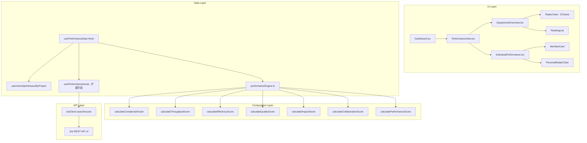
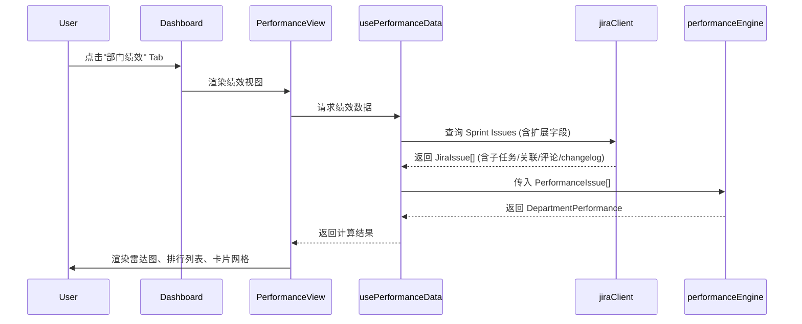

# Design Document: Department Performance Dashboard

## Overview

在现有 Dashboard 页面中新增"部门绩效"Tab 视图，提供基于 SPACE Framework + DORA Metrics 的五维度绩效评估体系。系统从 Jira Sprint 数据中提取任务完成情况、周期时间、返工率等客观指标，通过纯函数计算引擎生成吞吐量、效率、质量、影响力、协作五个维度的绩效分数，并以雷达图、排行列表、卡片网格等形式呈现部门整体和个人绩效详情。

### 设计目标

1. **与现有架构无缝集成**：复用现有 Dashboard Tab 机制、TanStack Query 数据层、ECharts 图表库
2. **计算逻辑可测试**：绩效计算引擎为纯函数模块，不依赖外部状态，支持属性测试
3. **数据驱动**：复杂度因子基于 ticket 元数据自动计算，不依赖人工维护的 Story Points
4. **响应式设计**：适配桌面和移动端（<900px 单列布局）

### 技术栈

- **前端框架**: React 18 + TypeScript
- **构建工具**: Vite 8
- **状态管理**: TanStack React Query v5
- **图表库**: ECharts 6 (echarts-for-react)
- **路由**: React Router v6
- **测试**: Vitest + fast-check (属性测试)
- **样式**: CSS Modules

## Architecture

### 系统架构图



### 数据流



### 与现有代码的集成方式

1. **Tab 集成**：在 `Dashboard.tsx` 的 `DashTab` 类型中新增 `'performance'`，在 Tab 栏中添加"部门绩效"按钮
2. **URL 参数**：通过 `useSearchParams` 读取 `tab=performance` 参数，支持直接链接访问
3. **数据复用**：基于现有 `useActiveSprintIssuesByProject` hook 扩展，新增 `usePerformanceIssues` 获取额外字段（子任务、关联、评论、changelog）
4. **样式复用**：复用 `Dashboard.module.css` 中已有的卡片、进度条、骨架屏样式，新增绩效专用样式

## Components and Interfaces

### 新增组件树

```
src/pages/Dashboard/
├── Dashboard.tsx              (修改: 新增 performance Tab)
├── PerformanceView.tsx        (新增: 绩效视图容器)
├── DepartmentOverview.tsx     (新增: 部门总览)
├── IndividualPerformance.tsx  (新增: 个人绩效详情)
├── PerformanceView.module.css (新增: 绩效视图样式)

src/lib/
├── performanceEngine.ts       (新增: 绩效计算引擎)
├── performanceEngine.test.ts  (新增: 单元测试 + 属性测试)

src/hooks/
├── usePerformanceData.ts      (新增: 绩效数据 Hook)
```

### 组件接口定义

#### PerformanceView (容器组件)

```typescript
interface PerformanceViewProps {
  issues: PlatformIssue[]
  performanceIssues: PerformanceIssue[]
  sprint: JiraSprint | null
  isLoading: boolean
}
```

职责：
- 管理部门总览 / 个人详情的子视图切换
- 调用 `usePerformanceData` 获取计算结果
- 处理加载状态和空状态

#### DepartmentOverview (部门总览)

```typescript
interface DepartmentOverviewProps {
  departmentPerformance: DepartmentPerformance
  isLoading: boolean
}
```

职责：
- 展示聚合指标卡片（6 个维度平均分）
- 展示五维度雷达图（团队平均）
- 展示绩效排行列表
- 展示绩效分布图

#### IndividualPerformance (个人绩效)

```typescript
interface IndividualPerformanceProps {
  memberPerformances: MemberPerformance[]
  isLoading: boolean
}
```

职责：
- 以卡片网格展示所有成员
- 支持按各维度排序
- 点击卡片展开详细任务列表
- 每张卡片含个人雷达图

## Data Models

### 绩效计算输入数据模型

```typescript
/** 扩展的 Issue 数据，包含绩效计算所需的额外字段 */
export interface PerformanceIssue extends PlatformIssue {
  subtaskCount: number          // 子任务数量
  linkedIssueCount: number      // 关联 issue 数量
  commentCount: number          // 评论数量
  sprintChanges: number         // 跨 Sprint 次数（从 changelog 解析）
  isReopened: boolean           // 是否被 reopen 过
  linkedBugCount: number        // 关联的 Bug 类型 issue 数量
  statusTransitions: StatusTransition[]  // 状态变更历史
  comments: IssueComment[]      // 评论列表（含作者信息）
}

/** 状态变更记录 */
export interface StatusTransition {
  from: string
  to: string
  timestamp: string  // ISO 8601
}

/** Issue 评论 */
export interface IssueComment {
  authorId: string
  authorName: string
  createdAt: string  // ISO 8601
}
```

### 绩效计算输出数据模型

```typescript
/** 单个成员的绩效结果 */
export interface MemberPerformance {
  memberId: string
  memberName: string
  avatarUrl: string | null
  performanceScore: number       // 综合绩效分 0-100
  throughputScore: number        // 吞吐量 0-100
  efficiencyScore: number        // 效率 0-100
  qualityScore: number           // 质量 0-100
  impactScore: number            // 影响力 0-100
  collaborationScore: number     // 协作 0-100
  grade: PerformanceGrade        // 绩效等级
  details: PerformanceDetails    // 明细数据
  tasks: PerformanceIssue[]      // 该成员的任务列表
}

/** 绩效等级 */
export type PerformanceGrade = 'excellent' | 'good' | 'average' | 'needs_improvement'

/** 绩效明细 */
export interface PerformanceDetails {
  // 吞吐量明细
  completedTaskCount: number
  complexityWeightedOutput: number
  // 效率明细
  averageCycleTime: number       // 天
  deliveryRate: number           // 0-1
  // 质量明细
  reworkRate: number             // 0-1
  bugIntroductionRate: number | null  // 0-1 或 null（数据不可得）
  // 影响力明细
  highPriorityCompletionRatio: number  // 0-1
  blockingResolutionSpeed: number      // 天
  // 协作明细
  crossTeamCommentCount: number
  crossTeamTaskRatio: number     // 0-1
}

/** 部门整体绩效 */
export interface DepartmentPerformance {
  averageScore: number
  averageThroughput: number
  averageEfficiency: number
  averageQuality: number
  averageImpact: number
  averageCollaboration: number
  totalCompletedTasks: number
  averageCycleTime: number
  members: MemberPerformance[]
  distribution: PerformanceDistribution
}

/** 绩效分布 */
export interface PerformanceDistribution {
  excellent: number    // 80-100 人数
  good: number         // 60-79 人数
  average: number      // 40-59 人数
  needsImprovement: number  // 0-39 人数
}

/** 复杂度因子 */
export interface ComplexityFactorInput {
  subtaskCount: number
  linkedIssueCount: number
  commentCount: number
  sprintChanges: number
}
```

### 绩效计算引擎配置

```typescript
/** 维度权重配置 */
export interface PerformanceWeights {
  throughput: number   // 默认 0.20
  efficiency: number   // 默认 0.25
  quality: number      // 默认 0.25
  impact: number       // 默认 0.15
  collaboration: number // 默认 0.15
}

export const DEFAULT_WEIGHTS: PerformanceWeights = {
  throughput: 0.20,
  efficiency: 0.25,
  quality: 0.25,
  impact: 0.15,
  collaboration: 0.15,
}
```

## 绩效计算引擎设计

### 模块结构 (`src/lib/performanceEngine.ts`)

绩效计算引擎为纯函数模块，所有函数无副作用，输入确定则输出确定。

#### 核心函数

```typescript
// 主入口：计算部门整体绩效
export function calculateDepartmentPerformance(
  issues: PerformanceIssue[],
  sprint: { startDate: string; endDate: string },
  weights?: PerformanceWeights
): DepartmentPerformance

// 计算单个成员绩效
export function calculateMemberPerformance(
  memberIssues: PerformanceIssue[],
  allIssues: PerformanceIssue[],
  sprint: { startDate: string; endDate: string },
  weights?: PerformanceWeights
): MemberPerformance

// 计算复杂度因子
export function calculateComplexityFactor(
  input: ComplexityFactorInput
): number  // 1.0 ~ 5.0

// 各维度计算函数
export function calculateThroughputScore(
  memberIssues: PerformanceIssue[],
  allMemberStats: { completedCount: number; weightedOutput: number }[]
): { score: number; completedCount: number; weightedOutput: number }

export function calculateEfficiencyScore(
  memberIssues: PerformanceIssue[],
  sprint: { startDate: string; endDate: string }
): { score: number; avgCycleTime: number; deliveryRate: number }

export function calculateQualityScore(
  memberIssues: PerformanceIssue[]
): { score: number; reworkRate: number; bugIntroductionRate: number | null }

export function calculateImpactScore(
  memberIssues: PerformanceIssue[]
): { score: number; highPriorityRatio: number; blockingResolutionSpeed: number }

export function calculateCollaborationScore(
  memberIssues: PerformanceIssue[],
  allIssues: PerformanceIssue[],
  memberId: string
): { score: number; crossTeamComments: number; crossTeamTaskRatio: number }
```

#### 复杂度因子计算规则

```typescript
export function calculateComplexityFactor(input: ComplexityFactorInput): number {
  let factor = 1.0

  // 子任务数
  if (input.subtaskCount > 6) factor += 1.0
  else if (input.subtaskCount > 3) factor += 0.5

  // 关联 issue 数
  if (input.linkedIssueCount > 5) factor += 0.6
  else if (input.linkedIssueCount > 2) factor += 0.3

  // 评论数
  if (input.commentCount > 10) factor += 0.6
  else if (input.commentCount > 5) factor += 0.3

  // 跨 Sprint 次数
  if (input.sprintChanges > 0) factor += 0.3 * input.sprintChanges

  // 限制范围
  return Math.min(5.0, Math.max(1.0, factor))
}
```

#### 绩效等级映射

```typescript
export function getPerformanceGrade(score: number): PerformanceGrade {
  if (score >= 80) return 'excellent'
  if (score >= 60) return 'good'
  if (score >= 40) return 'average'
  return 'needs_improvement'
}

export function getGradeColor(grade: PerformanceGrade): string {
  switch (grade) {
    case 'excellent': return '#52c41a'      // 绿色
    case 'good': return '#1677ff'           // 蓝色
    case 'average': return '#fa8c16'        // 橙色
    case 'needs_improvement': return '#f5222d'  // 红色
  }
}
```

### 数据获取策略

`usePerformanceData` hook 需要获取比标准 Sprint Issues 更多的字段：

```typescript
// 需要额外请求的 Jira 字段
const PERFORMANCE_FIELDS = [
  'summary', 'status', 'priority', 'assignee',
  'labels', 'created', 'updated',
  'subtasks',           // 子任务列表
  'issuelinks',        // 关联 issue
  'comment',           // 评论
  'changelog',         // 状态变更历史（需要 expand=changelog）
]
```

由于 Jira 6.x 的 changelog 需要通过 `expand=changelog` 参数获取，且单次请求数据量较大，采用以下策略：

1. **首次加载**：使用 `useActiveSprintIssuesByProject` 获取基础 Issue 列表（快速渲染骨架）
2. **扩展加载**：通过 `usePerformanceIssues` 获取含扩展字段的完整数据
3. **缓存策略**：staleTime 设为 5 分钟，与现有 hook 保持一致


## Correctness Properties

*A property is a characteristic or behavior that should hold true across all valid executions of a system—essentially, a formal statement about what the system should do. Properties serve as the bridge between human-readable specifications and machine-verifiable correctness guarantees.*

### Property 1: Weighted score equals sum of dimension scores times weights

*For any* set of five dimension scores (each in 0-100) and any valid weight configuration (weights summing to 1.0), the calculated `performanceScore` SHALL equal the sum of each dimension score multiplied by its corresponding weight, rounded to the nearest integer.

**Validates: Requirements 4.1**

### Property 2: All output scores are normalized to [0, 100]

*For any* valid set of `PerformanceIssue` inputs, all output scores (`performanceScore`, `throughputScore`, `efficiencyScore`, `qualityScore`, `impactScore`, `collaborationScore`) SHALL be in the range [0, 100] inclusive.

**Validates: Requirements 4.2**

### Property 3: Complexity factor follows formula and is clamped to [1.0, 5.0]

*For any* `ComplexityFactorInput` with non-negative integer values for `subtaskCount`, `linkedIssueCount`, `commentCount`, and `sprintChanges`, the calculated complexity factor SHALL follow the additive formula specified in the requirements and the result SHALL be clamped to the range [1.0, 5.0].

**Validates: Requirements 4.9**

### Property 4: Quality score handles bug data availability correctly

*For any* set of completed `PerformanceIssue` items, when `linkedBugCount` data is available (non-null), the quality score SHALL incorporate both `reworkRate` and `bugIntroductionRate`; when bug data is unavailable (all null), the quality score SHALL be computed solely from `reworkRate`, and both calculations SHALL produce scores in [0, 100].

**Validates: Requirements 4.5, 4.6**

### Property 5: Efficiency score correctly reflects cycle time and delivery rate

*For any* set of `PerformanceIssue` items with valid `statusTransitions` (containing In Progress → Done transitions), the efficiency score SHALL decrease monotonically as average cycle time increases (holding delivery rate constant), and SHALL increase monotonically as delivery rate increases (holding cycle time constant).

**Validates: Requirements 4.4**

### Property 6: Throughput score reflects relative ranking in team

*For any* team of 2+ members where one member has strictly more completed tasks AND higher complexity-weighted output than another, the first member's throughput score SHALL be greater than or equal to the second member's throughput score.

**Validates: Requirements 4.3**

### Property 7: Impact score reflects high-priority task completion

*For any* member's completed tasks, if the proportion of high-priority (P0/P1) tasks increases while total task count remains the same, the impact score SHALL not decrease.

**Validates: Requirements 4.7**

### Property 8: Collaboration score reflects cross-team participation

*For any* member and set of issues, if the number of comments on other members' tasks increases while other factors remain constant, the collaboration score SHALL not decrease.

**Validates: Requirements 4.8**

### Property 9: Calculation idempotence

*For any* valid `PerformanceIssue[]` input and sprint configuration, calling `calculateDepartmentPerformance` twice with identical inputs SHALL produce identical `DepartmentPerformance` output.

**Validates: Requirements 4.10**

### Property 10: Performance distribution is a valid partition

*For any* set of `MemberPerformance` results, the sum of `distribution.excellent + distribution.good + distribution.average + distribution.needsImprovement` SHALL equal the total number of members, and each member SHALL appear in exactly the bucket corresponding to their `performanceScore` range.

**Validates: Requirements 2.5**

### Property 11: Grade color mapping is consistent with score ranges

*For any* score in [0, 100], `getPerformanceGrade(score)` SHALL return `'excellent'` for scores ≥ 80, `'good'` for 60-79, `'average'` for 40-59, and `'needs_improvement'` for 0-39.

**Validates: Requirements 6.1**

### Property 12: Member ranking is correctly sorted by specified dimension

*For any* list of `MemberPerformance` items and any valid sort key (performanceScore, throughputScore, efficiencyScore, qualityScore, impactScore, collaborationScore), sorting by that key SHALL produce a list in descending order of the specified dimension's score.

**Validates: Requirements 2.3, 3.5**

## Error Handling

### 数据加载错误

| 场景 | 处理方式 |
|------|----------|
| Jira API 请求失败 | 显示错误横幅（复用现有 `errorBanner` 样式），提供重试按钮 |
| 网络超时 | TanStack Query 自动重试 3 次，最终显示错误状态 |
| 401/403 认证错误 | 不重试，显示认证失败提示 |
| 部分字段缺失（如 changelog 不可用） | 降级处理：跳过依赖该字段的计算，使用可用数据计算部分指标 |

### 计算引擎错误

| 场景 | 处理方式 |
|------|----------|
| 成员无已完成任务 | 吞吐量和效率分数为 0，不影响其他成员计算 |
| 除零错误（如团队 0 人） | 所有聚合指标返回 0，显示空状态 |
| 无 Bug 关联数据 | Quality_Score 仅基于 Rework_Rate 计算（需求 4.6） |
| 无评论数据 | Collaboration_Score 中评论相关子项得 0 分 |
| 无 changelog 数据 | Cycle_Time 使用 createdAt → updatedAt 近似，sprintChanges 设为 0 |

### 边界情况

- **单人团队**：排名分数直接给满分（无相对比较意义时）
- **所有任务未完成**：效率和吞吐量分数为 0，不报错
- **Sprint 日期异常**：如 endDate < startDate，使用 0 天作为 duration，避免负数

## Testing Strategy

### 测试框架

- **单元测试**: Vitest
- **属性测试**: fast-check (已在 devDependencies 中)
- **组件测试**: @testing-library/react

### 属性测试 (Property-Based Testing)

绩效计算引擎是纯函数模块，非常适合属性测试。使用 `fast-check` 库：

- 每个属性测试运行 **最少 100 次迭代**
- 每个测试用注释标注对应的设计文档属性
- 标注格式: `Feature: department-performance-dashboard, Property {number}: {property_text}`

**测试文件**: `src/lib/performanceEngine.test.ts`

重点覆盖：
1. `calculateComplexityFactor` — 公式正确性 + 范围约束 (Property 3)
2. `calculatePerformanceScore` — 加权求和正确性 (Property 1)
3. 所有维度计算函数 — 输出范围 [0, 100] (Property 2)
4. `calculateQualityScore` — Bug 数据可用/不可用两种路径 (Property 4)
5. `calculateDepartmentPerformance` — 幂等性 (Property 9)
6. `getPerformanceGrade` — 等级映射 (Property 11)
7. 排序函数 — 排序正确性 (Property 12)
8. 分布计算 — 分区完整性 (Property 10)

### 单元测试 (Example-Based)

**测试文件**: `src/lib/performanceEngine.test.ts`（与属性测试同文件）

覆盖场景：
- 具体数值验证（已知输入 → 预期输出）
- 边界情况：空数组、单人团队、全部未完成
- Bug 数据不可得时的降级逻辑
- 复杂度因子各阈值边界

### 组件测试

**测试文件**: `src/pages/Dashboard/PerformanceView.test.tsx`

覆盖场景：
- Tab 切换交互
- 加载状态（骨架屏）
- 空状态提示
- URL 参数 `tab=performance` 激活
- 排序交互
- 卡片展开/收起

### 测试覆盖目标

| 模块 | 覆盖率目标 | 测试类型 |
|------|-----------|----------|
| performanceEngine.ts | >95% | 属性测试 + 单元测试 |
| usePerformanceData.ts | >80% | 集成测试 (MSW mock) |
| PerformanceView 组件 | >80% | 组件测试 |
| DepartmentOverview 组件 | >70% | 组件测试 |
| IndividualPerformance 组件 | >70% | 组件测试 |
