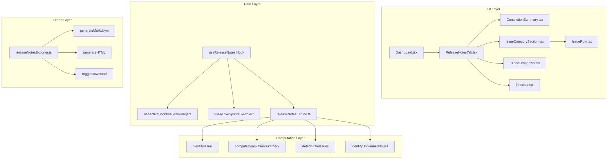
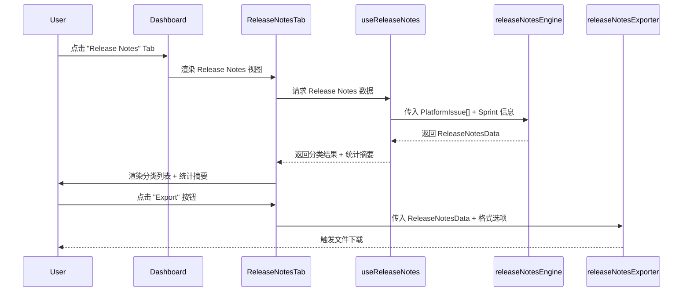

# Design Document: Sprint Release Notes

## Overview

在现有 Dashboard 页面中新增 "Release Notes" Tab，自动从当前活跃 Sprint 的 Jira 数据中聚合已完成和进行中的 Issue，按类型分类展示（Feature、Bug Fix、Hot Fix、Improvement、Other），并提供完成度统计摘要、插队 Issue 标识、状态不一致提醒、以及 Markdown/HTML 导出功能。

### 设计目标

1. **与现有架构无缝集成**：复用 Dashboard Tab 机制、TanStack Query 数据层、现有 `useActiveSprintIssuesByProject` hook 和 `statusMapper`
2. **分类逻辑可测试**：Issue 分类引擎为纯函数模块，不依赖外部状态，支持属性测试
3. **导出格式一致**：Markdown 和 HTML 导出内容结构一致，参考项目已有的 `release-note-v1.1.0.html` 风格
4. **状态感知**：自动检测 Sprint 临近结束时状态未更新的 Issue，辅助 PM 跟进

### 技术栈

- **前端框架**: React 18 + TypeScript
- **构建工具**: Vite 8
- **状态管理**: TanStack React Query v5
- **路由**: React Router v6
- **测试**: Vitest + fast-check (属性测试)
- **样式**: CSS Modules

## Architecture

### 系统架构图



### 数据流



### 与现有代码的集成方式

1. **Tab 集成**：在 `Dashboard.tsx` 的 `DashTab` 类型中新增 `'release-notes'`，在 Tab 栏中添加 "Release Notes" 按钮（仅当活跃 Sprint 存在时显示）
2. **数据复用**：直接复用现有 `useActiveSprintIssuesByProject` 和 `useActiveSprintsByProject` hook，无需额外 API 调用
3. **分类逻辑**：基于 `PlatformIssue.labels` 和 Jira issue type（需从 JiraIssue 原始数据中保留 `issueType` 字段）进行分类
4. **样式复用**：复用 `Dashboard.module.css` 中已有的卡片、骨架屏样式，新增 Release Notes 专用样式

## Components and Interfaces

### 新增文件结构

```
src/pages/Dashboard/
├── Dashboard.tsx                  (修改: 新增 release-notes Tab)
├── ReleaseNotesTab.tsx            (新增: Release Notes 视图容器)
├── ReleaseNotesTab.module.css     (新增: Release Notes 样式)

src/lib/
├── releaseNotesEngine.ts          (新增: 分类 + 统计计算引擎)
├── releaseNotesEngine.test.ts     (新增: 单元测试 + 属性测试)
├── releaseNotesExporter.ts        (新增: Markdown/HTML 导出)
├── releaseNotesExporter.test.ts   (新增: 导出测试)

src/hooks/
├── useReleaseNotes.ts             (新增: Release Notes 数据 Hook)

src/types/
├── platform.ts                    (修改: 新增 ReleaseNotes 相关类型)
```

### 组件接口定义

#### ReleaseNotesTab (容器组件)

```typescript
interface ReleaseNotesTabProps {
  issues: PlatformIssue[]
  sprint: JiraSprint | null
  isLoading: boolean
}
```

职责：
- 管理筛选状态（仅插队 / 仅状态待更新）
- 调用 `useReleaseNotes` hook 获取计算结果
- 渲染 CompletionSummary、IssueCategorySection、ExportDropdown
- 处理加载状态和错误状态

#### CompletionSummary (统计摘要)

```typescript
interface CompletionSummaryProps {
  summary: ReleaseNotesSummary
  staleWarningCount: number
}
```

职责：
- 展示总数、已完成数、完成率
- 展示 Hot Fix 数量（独立指示器）
- 展示计划内 vs 插队比例
- 完成率低于 80% 时显示警告
- 有状态待更新 Issue 时显示提醒

#### IssueCategorySection (分类区块)

```typescript
interface IssueCategorySectionProps {
  category: IssueCategory
  issues: ClassifiedIssue[]
  defaultExpanded?: boolean
}
```

职责：
- 可折叠的分类区块，显示分类名称和 Issue 数量
- 渲染该分类下的所有 IssueRow

#### IssueRow (单条 Issue)

```typescript
interface IssueRowProps {
  issue: ClassifiedIssue
  sprintEndDate: string
}
```

职责：
- 展示 issue key、title、status、priority、assignee
- 已完成显示 ✓ 图标，未完成显示状态 badge
- 插队 Issue 显示 "插队" badge
- 状态待更新显示 "状态待更新" 警告 badge

#### ExportDropdown (导出按钮)

```typescript
interface ExportDropdownProps {
  releaseNotesData: ReleaseNotesData
  projectKey: string
  sprintName: string
}
```

职责：
- 下拉菜单提供 Markdown / HTML 两种格式选项
- 点击后调用 `releaseNotesExporter` 生成文件并触发下载

## Data Models

### Issue 分类相关类型

```typescript
/** Issue 分类枚举 */
export type IssueCategory = 'feature' | 'bug_fix' | 'hot_fix' | 'improvement' | 'other'

/** 分类后的 Issue */
export interface ClassifiedIssue extends PlatformIssue {
  category: IssueCategory
  isUnplanned: boolean        // 是否为插队 Issue（createdAt > sprint startDate）
  isStaleStatus: boolean      // 是否状态待更新（Sprint 临近结束但状态未完成）
}

/** 按分类分组的结果 */
export interface CategorizedIssues {
  feature: ClassifiedIssue[]
  bug_fix: ClassifiedIssue[]
  hot_fix: ClassifiedIssue[]
  improvement: ClassifiedIssue[]
  other: ClassifiedIssue[]
}
```

### 统计摘要类型

```typescript
/** Release Notes 完成度统计 */
export interface ReleaseNotesSummary {
  totalCount: number
  completedCount: number
  completionRate: number          // 0-100
  hotFixCount: number
  baselineCount: number           // 计划内 Issue 数
  unplannedCount: number          // 插队 Issue 数
  isCompletionWarning: boolean    // completionRate < 80
}
```

### Release Notes 聚合数据

```typescript
/** Release Notes 完整数据（用于渲染和导出） */
export interface ReleaseNotesData {
  sprintName: string
  sprintStartDate: string
  sprintEndDate: string
  projectKey: string
  summary: ReleaseNotesSummary
  categorizedIssues: CategorizedIssues
  staleIssues: ClassifiedIssue[]
  generatedAt: string             // ISO 8601 生成时间戳
}
```

### 导出配置类型

```typescript
/** 导出格式 */
export type ExportFormat = 'markdown' | 'html'

/** 导出选项 */
export interface ExportOptions {
  format: ExportFormat
  projectKey: string
  sprintName: string
}
```

### 分类规则配置

```typescript
/** 分类规则（优先级从高到低） */
export const CATEGORY_RULES: Array<{
  category: IssueCategory
  labelPatterns: RegExp[]
  issueTypes: string[]
}> = [
  {
    category: 'hot_fix',
    labelPatterns: [/hotfix/i, /hot-fix/i, /hot_fix/i],
    issueTypes: [],
  },
  {
    category: 'bug_fix',
    labelPatterns: [/bug/i],
    issueTypes: ['Bug'],
  },
  {
    category: 'feature',
    labelPatterns: [/feature/i, /story/i],
    issueTypes: ['Story'],
  },
  {
    category: 'improvement',
    labelPatterns: [/improvement/i, /enhancement/i],
    issueTypes: [],
  },
]
```

### 计算引擎核心函数签名

```typescript
// 分类单个 Issue
export function classifyIssue(
  issue: PlatformIssue,
  sprintStartDate: string,
  sprintEndDate: string,
  issueType?: string
): ClassifiedIssue

// 批量分类并分组
export function categorizeIssues(
  issues: PlatformIssue[],
  sprintStartDate: string,
  sprintEndDate: string,
  issueTypes?: Map<string, string>  // issueId -> issueType
): CategorizedIssues

// 计算完成度统计
export function computeCompletionSummary(
  categorizedIssues: CategorizedIssues
): ReleaseNotesSummary

// 检测状态待更新的 Issue
export function detectStaleIssues(
  issues: ClassifiedIssue[],
  sprintEndDate: string,
  now?: Date
): ClassifiedIssue[]

// 生成完整 Release Notes 数据
export function buildReleaseNotesData(
  issues: PlatformIssue[],
  sprint: { name: string; startDate: string; endDate: string },
  projectKey: string,
  issueTypes?: Map<string, string>
): ReleaseNotesData
```


## Correctness Properties

*A property is a characteristic or behavior that should hold true across all valid executions of a system—essentially, a formal statement about what the system should do. Properties serve as the bridge between human-readable specifications and machine-verifiable correctness guarantees.*

### Property 1: Classification completeness and mutual exclusivity

*For any* set of `PlatformIssue` items and valid sprint date range, classifying all issues SHALL produce a partition where every issue appears in exactly one category (feature, bug_fix, hot_fix, improvement, or other), and the total count across all categories equals the input issue count.

**Validates: Requirements 2.1**

### Property 2: Classification rule priority correctness

*For any* `PlatformIssue` with a label matching "hotfix" or "hot-fix" (case-insensitive), the classification SHALL be `hot_fix` regardless of other labels or issue type. For any issue with a "bug" label or Bug issue type (and no hotfix label), the classification SHALL be `bug_fix`. For any issue with a "feature" or "story" label or Story issue type (and no hotfix/bug match), the classification SHALL be `feature`. For any issue with an "improvement" or "enhancement" label (and no higher-priority match), the classification SHALL be `improvement`. For any issue matching none of the above, the classification SHALL be `other`.

**Validates: Requirements 2.2, 2.3, 2.4, 2.5, 2.6**

### Property 3: Completion summary arithmetic consistency

*For any* set of classified issues, the computed `ReleaseNotesSummary` SHALL satisfy: `totalCount` equals the total number of issues, `completedCount` equals the number of issues with status "done", `completionRate` equals `Math.round((completedCount / totalCount) * 100)` (or 0 when totalCount is 0), and `baselineCount + unplannedCount` equals `totalCount`.

**Validates: Requirements 4.1, 4.3, 5.3**

### Property 4: Completion warning threshold

*For any* set of issues where the computed completion rate is strictly less than 80, the `isCompletionWarning` flag SHALL be `true`. For any set where the completion rate is 80 or above, the flag SHALL be `false`.

**Validates: Requirements 4.4**

### Property 5: Unplanned issue detection

*For any* `PlatformIssue` and sprint start date, if the issue's `createdAt` timestamp is strictly after the sprint `startDate`, then `isUnplanned` SHALL be `true`. If `createdAt` is on or before `startDate`, then `isUnplanned` SHALL be `false`.

**Validates: Requirements 5.1**

### Property 6: Stale status detection

*For any* `ClassifiedIssue` with status "in_progress" or "in_testing", and a current time within 2 days of the sprint `endDate`, the `isStaleStatus` flag SHALL be `true`. For issues with status "done" or "todo" or "in_review", or when the sprint end is more than 2 days away, `isStaleStatus` SHALL be `false`.

**Validates: Requirements 7.1**

### Property 7: Export content completeness

*For any* valid `ReleaseNotesData`, exporting to Markdown format SHALL produce a string containing the sprint name, start date, end date, total count, completed count, completion rate, and at least one issue key from each non-empty category. Exporting to HTML format SHALL produce a string containing the same information elements.

**Validates: Requirements 6.2, 6.3**

### Property 8: Export filename and timestamp

*For any* valid project key and sprint name, the generated export filename SHALL match the pattern `release-notes-{projectKey}-{sprintName}.{ext}` where ext is "md" for Markdown and "html" for HTML. The exported content SHALL contain a generation timestamp in ISO 8601 format.

**Validates: Requirements 6.4, 6.5**

### Property 9: Hot fix count consistency

*For any* set of classified issues, the `hotFixCount` in the completion summary SHALL equal the number of issues classified as `hot_fix` in the categorized issues.

**Validates: Requirements 4.2**

## Error Handling

### 数据加载错误

| 场景 | 处理方式 |
|------|----------|
| Jira API 请求失败 | 显示错误横幅（复用现有 `errorBanner` 样式），提供重试按钮 |
| 网络超时 | TanStack Query 自动重试 3 次，最终显示错误状态 |
| 401/403 认证错误 | 不重试，显示认证失败提示 |
| 无活跃 Sprint | 隐藏 Release Notes Tab，不显示错误 |

### 计算引擎错误

| 场景 | 处理方式 |
|------|----------|
| Issue 列表为空 | 显示空状态提示："当前 Sprint 暂无 Issue" |
| Sprint 日期缺失 | 跳过插队检测和状态过期检测，仅做分类 |
| Issue 无 labels 字段 | 视为空数组，分类为 Other |
| 除零错误（totalCount = 0） | completionRate 设为 0，不报错 |

### 导出错误

| 场景 | 处理方式 |
|------|----------|
| 浏览器不支持 Blob/download | 降级为打开新窗口显示内容 |
| 文件名含特殊字符 | 对 sprintName 进行 sanitize（替换非法字符为 `-`） |
| 导出内容为空 | 仍生成文件，包含 Sprint 信息和 "无 Issue" 提示 |

### 边界情况

- **Sprint endDate 已过**：仍正常显示，stale 检测基于当前时间判断
- **所有 Issue 都是插队**：baselineCount = 0，unplannedCount = totalCount，正常显示
- **Issue 同时匹配多个分类规则**：按优先级取第一个匹配（hot_fix > bug_fix > feature > improvement > other）
- **Sprint 名称含特殊字符**：导出文件名中进行 sanitize

## Testing Strategy

### 测试框架

- **单元测试**: Vitest
- **属性测试**: fast-check (已在 devDependencies 中)
- **组件测试**: @testing-library/react

### 属性测试 (Property-Based Testing)

Release Notes 的分类引擎和统计计算为纯函数模块，非常适合属性测试。使用 `fast-check` 库：

- 每个属性测试运行 **最少 100 次迭代**
- 每个测试用注释标注对应的设计文档属性
- 标注格式: `Feature: sprint-release-notes, Property {number}: {property_text}`

**测试文件**: `src/lib/releaseNotesEngine.test.ts`

重点覆盖：
1. `classifyIssue` — 分类规则优先级正确性 (Property 2)
2. `categorizeIssues` — 分类完整性和互斥性 (Property 1)
3. `computeCompletionSummary` — 统计算术一致性 (Property 3)
4. `computeCompletionSummary` — 警告阈值 (Property 4)
5. `classifyIssue` — 插队检测 (Property 5)
6. `detectStaleIssues` — 状态过期检测 (Property 6)
7. `computeCompletionSummary` — Hot fix 计数一致性 (Property 9)

**测试文件**: `src/lib/releaseNotesExporter.test.ts`

重点覆盖：
8. `generateMarkdown` / `generateHTML` — 导出内容完整性 (Property 7)
9. 文件名生成 — 文件名模式 + 时间戳 (Property 8)

### 单元测试 (Example-Based)

**测试文件**: `src/lib/releaseNotesEngine.test.ts`（与属性测试同文件）

覆盖场景：
- 具体分类示例：label "HotFix-123" → hot_fix, label "bug" → bug_fix
- 边界情况：空 labels、空 issues 列表、Sprint 日期缺失
- 多规则匹配时的优先级验证
- completionRate 为 0% 和 100% 的边界

### 组件测试

**测试文件**: `src/pages/Dashboard/ReleaseNotesTab.test.tsx`

覆盖场景：
- Tab 显示/隐藏（有/无活跃 Sprint）
- 加载状态（骨架屏）
- 错误状态 + 重试按钮
- 分类折叠/展开交互
- 筛选切换（仅插队 / 仅状态待更新）
- 导出按钮下拉菜单

### 测试覆盖目标

| 模块 | 覆盖率目标 | 测试类型 |
|------|-----------|----------|
| releaseNotesEngine.ts | >95% | 属性测试 + 单元测试 |
| releaseNotesExporter.ts | >90% | 属性测试 + 单元测试 |
| useReleaseNotes.ts | >80% | 集成测试 (MSW mock) |
| ReleaseNotesTab 组件 | >80% | 组件测试 |
