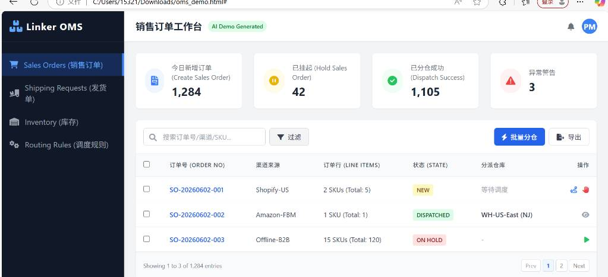
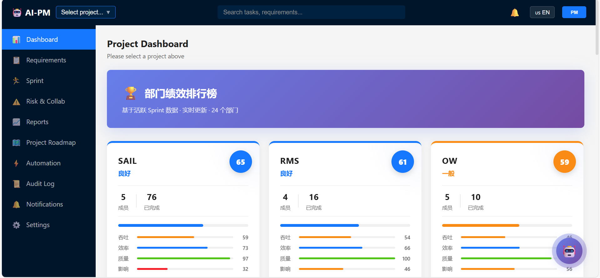

# PM 角色转型方案：从对内管理到对外交付

---

## 核心摘要

**用 AI 把"管理"的事交给平台，把人的精力集中在"交付"上——交付客户价值、交付 AI 转型成果。**

三条主线：

1. **AI 驱动对内管理**：AI-PM 平台 → 各部门自组织自管理 → 绩效透明化 → 无需人工 PM 介入
2. **AI 赋能对外交付**：AI 辅助需求分析 → AI 快速出方案/Demo → 分级交付 → 直接创造商业价值
3. **AI 转型推进**：自己先用 → 验证效果 → 组织每周二 AI 会议 → 输出报告 → 推动全公司提效

本方案包含以下几大块：

1. **背景与现状**：公司 AI 转型背景、AI-PM 平台已具备的能力
2. **转型目标**：从对内管理到对外交付的角色转变
3. **对外 PM 职责**：需求对接、方案输出、分级交付
4. **方案设计**：对内平台自管理 + 对外客户交付 + AI 转型推进
5. **价值分析**：对公司、团队、客户的具体收益
6. **实施计划与工作分配**

> 这不是未来计划，而是已经在做的事——AI-PM 平台就是最好的证明。

---

## 一、背景与现状分析

### 1.1 公司现状

公司目前正全面推进 AI 转型，研发体系涵盖 **24 个项目部门**（AIAG、APS、BP、BI、CRMC、CRM、CYC、CSR、FMS、HRM、DTS、AIH、OW、PLATFORM、RE、RP、RMS、SAIL、TMS、TRF、VRM、WCS、WSP、WISE2018），全部使用 Jira 进行项目管理，累计数据量 **数万条 issues**。

当前对内 PM 的日常工作主要包括：
- 每日跟踪各部门 Sprint 进度（人工查 Jira）
- 协调跨部门资源和依赖
- 生成日报/周报/Sprint 复盘报告
- 识别和跟进风险
- 需求拆解和优先级排列

### 1.2 已建成的 AI-PM 平台能力

经过持续建设，AI-PM 智能项目管理平台（https://ai-pm-platform.item.pub/）已覆盖对内 PM 的绝大部分工作：

| 平台模块 | 能力 | 替代的 PM 工作 |
|----------|------|---------------|
| **Dashboard 驾驶舱** | Sprint 完成率、任务分布、团队负载、燃尽图 | 人工汇总进度 |
| **部门绩效排行榜** | SPACE+DORA 五维度评估（吞吐量20%、效率25%、质量25%、影响力15%、协作15%），24部门实时排名 | 人工绩效跟踪 |
| **Sprint 管理** | 5列看板、资源视图、AI变更检测、AI规划推荐 | 人工盯迭代 |
| **风险与协作** | 自动识别延期/阻塞/未分配任务，企微一键推送 | 人工风险识别 |
| **报告中心** | 日报/周报/Sprint复盘自动生成，AI摘要，企微推送 | 人工写报告 |
| **需求管理** | 列表/看板视图，状态统计，AI健康度分析 | 人工需求跟踪 |
| **项目路线图** | 时间轴、里程碑管理 | 人工画路线图 |
| **Release Notes** | 自动聚合迭代Issue，按类型分类，导出Markdown/HTML | 人工写发版说明 |
| **AI 小助手** | 自然语言查询 Jira 数据 | PM答疑 |
| **通知中心** | 风险预警、变更通知实时推送 | 人工通知 |

### 1.3 Jira 数据支撑的绩效体系

平台已实现基于 Jira 实际数据的自动化绩效评估：

**数据采集维度：**
- Issue 状态流转历史（statusTransitions）→ 计算 Cycle Time
- 子任务数量、关联Issue数、评论数、跨Sprint次数 → 计算复杂度因子
- Developer/Reporter/QA 字段 → 角色识别
- 优先级（Highest/High/P0/P1）→ 影响力评估
- 跨团队评论 → 协作度评估
- Reopen/Bug关联 → 质量评估

**评估模型（SPACE + DORA 框架）：**

| 维度 | 权重 | 计算方式 | 数据来源 |
|------|------|----------|----------|
| 吞吐量 | 20% | 完成任务数 × 复杂度因子，团队百分位排名 | Jira status=done + subtasks/links/comments |
| 效率 | 25% | 平均 Cycle Time + Sprint内按时交付率 | Jira statusTransitions 时间差 |
| 质量 | 25% | 返工率(Reopen) + Bug引入率 | Jira isReopened + linkedBugCount |
| 影响力 | 15% | 高优任务完成比 + 阻塞解决速度 | Jira priority + linkedIssueCount |
| 协作 | 15% | 跨团队评论数 + 他人任务参与度 | Jira comments 作者分析 |

> **结论：平台已具备让各部门自组织、自管理的完整能力，PM 的对内管理工作可以完全由平台承接。**

---

## 二、转型目标

**核心转变：从"对内管理24个部门" → "对外直接服务客户"**

| 维度 | 现状（对内 PM） | 转型后（对外 PM） |
|------|-----------------|-------------------|
| 服务对象 | 内部 24 个开发部门 | 外部客户 |
| 核心产出 | 内部报告、协调纪要 | 客户方案、可运行 Demo |
| 管理方式 | 人工跟进 Jira | AI-PM 平台自动化 |
| 技术深度 | 仅需求层面 | 能独立实现简单需求 |
| 价值定位 | 成本中心（管理开销） | 利润中心（直接创收） |

---

## 三、对外 PM 的职责定义

### 3.1 我的角色定位

结合公司业务（物流/供应链 IT 解决方案），我的对外 PM 角色定位为：**技术型交付 PM**

- 直接对接客户需求，理解物流/供应链业务场景
- 快速输出可演示方案（Demo），缩短客户决策周期
- 简单需求自主交付，复杂需求协调开发团队
- 同时推动公司 AI 转型落地

### 3.2 对外 PM 核心工作内容

#### 需求阶段

| 工作项 | 具体内容 | 产出物 |
|--------|----------|--------|
| 客户需求对接 | 参与客户会议，理解业务场景和痛点 | 需求纪要 |
| 需求分析 | 提炼核心需求，评估可行性和工作量 | PRD / 需求规格 |
| 方案设计 | 基于客户场景输出技术方案 | 方案文档 |
| Demo 搭建 | 用 AI 工具快速搭建可交互原型 | 可运行 Demo |

#### 交付阶段

| 工作项 | 具体内容 | 产出物 |
|--------|----------|--------|
| 需求分发 | 复杂需求拆解为 Jira ticket，分配开发团队 | Jira Epic/Story |
| 进度跟踪 | 通过 AI-PM 平台跟踪交付进度 | 重点项目周报 |
| 客户同步 | 定期向客户汇报进展 | 项目进展报告 |
| 验收交付 | 协调测试、处理反馈、完成上线 | 验收报告 |

#### 持续跟进

| 工作项 | 具体内容 | 产出物 |
|--------|----------|--------|
| 客户反馈 | 收集使用反馈，转化为优化需求 | 反馈跟踪 |
| 迭代优化 | 持续改进已交付功能 | 迭代计划 |

### 3.3 行业趋势

- **AI 增强型 PM 已成行业标配**：AI 辅助需求分析、方案生成、原型搭建，大幅缩短从需求到 Demo 的周期
- **技术型 PM 需求上升**：能独立出 Demo 的 PM 可以直接缩短销售周期，客户看到实物后决策更快
- **对内管理被平台替代**：Jira + AI 分析覆盖了 80% 的项目跟踪工作，PM 的价值向客户侧转移

---

## 四、方案设计

### 4.1 对内管理：AI-PM 平台驱动各部门自组织自管理（无需 PM 介入）

**核心理念：开发团队不再需要 PM 来"管"，通过 AI-PM 平台实现自组织、自管理。**

各部门使用 AI-PM 平台（https://ai-pm-platform.item.pub/）自主运转：

**自组织机制：**
- 各团队自行在 Jira 中创建/规划/关闭 Sprint
- 团队内部自行分配任务、协调依赖
- 部门负责人通过 AI-PM 平台实时掌握团队状态，自行决策

**AI-PM 平台提供的自管理工具：**

| 能力 | 如何支持自管理 | 替代的 PM 工作 |
|------|---------------|---------------|
| Sprint 看板 | 各团队自行查看 5 列看板（待办→进行中→评审→测试→完成），状态一目了然 | PM 每天跟进进度 |
| 资源视图 | 团队负责人直接看到谁过载/谁空闲，自行调整 | PM 协调资源分配 |
| AI 变更检测 | 自动识别需求变更、范围蔓延(>20%警告)，团队自行响应 | PM 人工发现变更 |
| 绩效排行榜 | 24 部门绩效实时排名，团队自我激励、自我改进 | PM 做绩效统计 |
| 风险自动推送 | 延期/阻塞/超负荷自动推送企微群，团队自行解决 | PM 识别和跟进风险 |
| 报告自动生成 | 日报/周报/Sprint复盘一键生成，团队自行查看 | PM 写报告 |
| AI 规划推荐 | AI 从 Backlog 评分推荐候选任务，团队自行选择 | PM 安排任务 |
| Release Notes | 自动聚合迭代 Issue，团队自行导出发版说明 | PM 整理发版内容 |

**管理层监控（无需 PM 中转）：**
- Dashboard 全局视图 → 管理层一屏看全局
- 部门绩效排行榜 → 直观了解各团队表现
- 异常自动预警 → 推送到管理层企微群

> **结论：AI-PM 平台让对内管理工作从"PM 推动"变为"平台驱动、团队自驱"，PM 角色不再是必须。**

### 4.2 对外交付：直接对接客户需求

转型后，我的核心工作聚焦在客户侧：

**1. 需求承接与方案输出**

| 环节 | 我的工作 | 输出 |
|------|----------|------|
| 需求调研 | 参与客户会议，理解业务场景 | 需求调研纪要 |
| 需求分析 | 提炼核心需求，初步评估可行性 | PRD / 需求规格书 |
| 可行性评估 | 简单需求自己评估；复杂需求协同开发团队评估技术可行性和工作量 | 可行性评估结论 |
| 方案设计 | 简单需求自己出方案和 Demo；复杂需求协同开发团队出技术方案，我负责原型 | 技术方案 + Demo |
| 工作量评估 | 简单需求自己评估；复杂需求与开发团队一起拆解功能点 | 报价支撑材料 |

**2. 分级交付机制**

| 需求复杂度 | 判断标准 | 处理方式 | 交付周期 | 示例 |
|-----------|----------|----------|---------|------|
| 简单需求 | 前端展示、配置调整、报表定制 | 我自主实现（AI辅助编码） | 1-3 天 | 新增一个数据看板、调整报表字段 |
| 中等需求 | 新页面、简单接口、数据联动 | AI辅助开发 + 自主交付 | 3-7 天 | 新增客户管理模块、对接第三方API |
| 复杂需求 | 架构调整、核心逻辑、性能优化 | 拆解为 Jira ticket，开发团队实现 | 按迭代排期 | 新业务系统、大规模重构 |

**3. 快速 Demo 能力**

当前我已具备的技术栈和工具链：
- **前端**：React + TypeScript + Vite（AI-PM平台即为实证）
- **AI 编程工具**：Kiro（AI IDE），可快速生成功能代码
- **后端**：Express + Jira API 集成经验
- **部署**：Vercel（公网）+ 内网 Node.js 部署
- **数据可视化**：ECharts，擅长仪表盘和数据看板
- **Ontology 本体知识库**：AI 可直接读取公司 Ontology 底层业务字典，自动理解业务模型（实体、关系、流程），基于此快速生成贴合实际业务的 Demo，无需从零了解业务

> **核心优势：通过 Ontology + AI，我可以快速理解任何业务线的数据模型和流程，直接生成与客户业务贴合的可运行 Demo，大幅缩短从"了解需求"到"看到效果"的周期。**

> **AI-PM 平台本身就是我用 AI 工具开发的**，这证明了 PM + AI 工具可以独立完成中等复杂度的产品交付。

**4. 客户交付流程**

客户提出需求 → 需求分析 & 可行性评估（1天） → 方案设计 & Demo 搭建（1-3天） → 客户评审确认 → 简单/中等需求我自主实现（1-7天）或复杂需求创建 Jira ticket 开发团队排期 → 验收上线 → 客户反馈跟踪

**5. 已对接/可对接的具体项目**

转型后，我可以直接参与客户需求对接、业务理解和方案输出。以下是已了解并可承接的项目：

| 项目 | 客户/业务 | 我的角色 | 具体参与内容 |
|------|---------|---------|-----------|
| APS 排班规划系统 | 全美仓库 | 需求对接 + 方案跟进 | 了解七层架构设计、任务拆解逻辑（WMS订单→Task→Action）、人力排班算法、效率配置；跟进 IAM/HRM 打通、精细化排班算法落地 |
| YMS 园区管理 | 全美仓库 | 需求对接 + 系统熟悉 | 月台调度、集装箱进出管理、摄像头自动化；汇总相关系统链接，熟悉了解系统业务 |
| Glory Wisdom | 河南皮料工厂 | 客户对接 + 方案设计 | 理解供应链全流程（原材料→成品→跨境中转→关税规避）；OMS 订单路由、WMS 双单位材料管理、EDI 对接；汇总相关系统链接，熟悉了解业务 |
| LinkW 跨境物流 | 小品牌电商客户 | 客户对接 + 方案设计 | 理解整合订单→集中订舱→美国仓转运→一件代发流程；仓库自动化设备对接规划；汇总相关系统链接，熟悉了解业务 |

> **核心价值：转型后我直接了解业务、直接对接客户，而不是等开发团队翻译需求给我。通过 Ontology + AI 工具，我可以快速理解客户业务模型，输出方案和 Demo，缩短从"客户说需求"到"看到效果"的周期。**

### 4.3 AI 转型推进（核心重点）

> **本方案最核心的价值主张：我本人全面拥抱 AI，用 AI 工具做统筹管理、做交付、做研究，同时推动全公司 AI 转型落地。**

#### 4.3.1 我自己如何用 AI 做统筹管理

传统 PM 靠"人盯人"，转型后我用 **AI + 平台** 实现更高效的统筹管理：

| 管理场景 | 传统做法 | AI 赋能后的做法 | 效率提升 |
|----------|----------|----------------|---------|
| 跟踪 24 部门进度 | 逐个查 Jira，人工汇总 | AI-PM 平台自动聚合，异常自动推送企微 | 每天节省 2-3 小时 |
| 生成项目报告 | 手动写日报/周报 | AI 自动生成报告摘要，一键推送 | 每份报告从 1 小时 → 5 分钟 |
| 客户需求分析 | 人工拆解需求文档 | 用 AI（Claude/ChatGPT）辅助需求分析、生成 PRD | 分析效率提升 3-5 倍 |
| 方案设计 | 从零开始写方案 PPT | AI 生成方案初稿，我审核调整 | 方案输出从 3 天 → 半天 |
| Demo 开发 | 等开发排期 | 用 AI 编程工具（Kiro）自主搭建 | 从 2 周等待 → 1-3 天交付 |
| 会议纪要 | 手动记录整理 | AI 实时记录 + 自动整理 + 提取待办 | 纪要整理从 30 分钟 → 5 分钟 |
| 风险识别 | 凭经验判断 | AI 分析 Jira 数据，自动识别风险模式 | 从事后发现 → 事前预警 |
| 知识检索 | 翻文档、问人 | AI 助手直接查询 Jira 数据和项目知识库 | 即问即答 |

**我日常使用的 AI 工具矩阵：**

| 工具 | 用途 | 使用频率 |
|------|------|----------|
| **Kiro (AI IDE)** | 代码开发、Demo 搭建、平台迭代 | 每天 |
| **Claude / ChatGPT** | 需求分析、方案设计、文档撰写 | 每天 |
| **AI-PM 平台** | 项目监控、绩效跟踪、报告生成、团队自管理 | 每天 |
| **企业微信 AI Bot** | 风险推送、团队通知 | 自动化 |

**实际案例（已验证）：**
- AI-PM 平台：PRD 与 PM 团队一起 Review 更新，独立完成开发，从 0 到上线，覆盖 Sprint 管理、绩效评估、风险预警、报告生成等完整功能
- 基于 Ontology 本体知识库出 Demo：通过公司 Ontology 底层业务字典，AI 直接读取本体数据模型，快速生成客户可演示的业务系统 Demo（如 OMS 订单管理系统），已验证可行，后续可持续优化
- 部门绩效排行榜：SPACE+DORA 五维度模型设计 + 代码实现，1 周完成
- Release Notes 自动生成：需求分析到交付 3 天完成
- 用户指南（中英文）：AI 辅助撰写 + 导出 PDF/HTML

**案例展示：**

*AI 读取 Ontology 本体知识库生成的 OMS 系统 Demo：*

*AI-PM 智能项目管理平台：*

#### 4.3.2 推动全公司 AI 转型

**定位：公司 AI 转型的"先行者 + 布道者 + 跟进者"**

**1. AI 工具研究与落地**

| 工作项 | 频率 | 产出 | 目标 |
|--------|------|------|------|
| AI 编程工具评测 | 持续 | 评测报告（含效率数据） | 帮助团队选择最适合的工具 |
| AI 辅助开发实战验证 | 每周 | 实战案例（代码+效果对比） | 用真实数据说服团队 |
| 团队 AI 工具培训 | 月度 | 培训材料、录屏、FAQ | 降低团队使用门槛 |
| AI 编码最佳实践 | 季度 | 实践指南（Prompt 技巧、工作流） | 沉淀可复用的方法论 |
| 效率提升量化 | 每 Sprint | Before/After 对比数据 | 向管理层证明 ROI |

**2. AI 会议组织与跟进**

| 会议类型 | 频率 | 我的角色 | 产出 |
|----------|------|----------|------|
| AI 周会 | 每周二 | 组织 + 分享 + 演示 | 分享材料、Demo、Q&A 整理 |
| 管理层 AI 汇报 | 按需 | 准备材料 + 汇报 | 进展报告、ROI 数据 |

**3. AI 转型定期报告**

| 报告类型 | 频率 | 内容 | 受众 |
|----------|------|------|------|
| 重点项目周报 | 每周 | 重点项目进展、风险、下周计划 | 管理层 |
| 迭代报告 | 每个 Sprint | 各团队产出、效率数据、AI 工具使用情况 | 管理层 + 全员 |
| AI 转型季度总结 | 每季 | 阶段成果、投入产出比、下季规划、行业对标 | 高管层 |
| AI 工具选型报告 | 按需 | 工具对比、试用数据、采购建议 | 决策层 |

**4. AI 提升交付效率的核心价值**

AI 转型已经在进行中，核心目标是**通过 AI 工具直接提高交付效率和质量**：

| 交付环节 | AI 带来的提升 | 实际效果 |
|----------|-------------|---------|
| 需求分析 | AI 辅助拆解和结构化 | 分析时间缩短 60-70% |
| 方案设计 | AI 生成初稿 + 人工调整 | 方案输出从 3 天 → 半天 |
| Demo 开发 | AI 编程工具直接实现 | 从等排期 2 周 → 自主 1-3 天交付 |
| 代码开发 | AI 辅助编码 + Review | 开发效率提升 2-3 倍 |
| 文档撰写 | AI 生成 + 人工校对 | 文档产出效率提升 5 倍 |
| 测试验证 | AI 辅助生成测试用例 | 覆盖面更广、速度更快 |

> **核心观点：AI 不是未来的事，是现在正在用、已经验证有效的生产力工具。重点不是"要不要用"，而是"怎么用得更深、覆盖更广"。**

---

## 五、价值分析

### 5.1 对公司的价值

| 收益点 | 量化预估 | 说明 |
|--------|---------|------|
| 降低管理成本 | 节省 1 个对内 PM 岗位的管理开销 | 平台替代人工，24部门自管理 |
| 加快客户响应 | 客户需求响应时间从 1-2 周 → 1-3 天 | PM 直接对接 + AI 快速出 Demo |
| 提升交付效率 | 简单需求交付周期从 2 周 → 3 天 | 无需排队等开发资源 |
| 减少需求失真 | 返工率预计降低 30-50% | PM 直接面对客户，减少传递环节 |
| 推动 AI 落地 | 有专人研究+推进，避免AI转型停留在口号 | 定期报告、培训、最佳实践沉淀 |
| 创收潜力 | PM 可独立承接简单定制项目 | 提升团队产出上限 |

### 5.2 对团队的价值

- **开发团队**：自主性增强，减少"被管"感；绩效透明，优秀团队被看见
- **管理层**：24部门数据一屏可见，异常自动预警，无需层层汇报
- **客户**：响应更快，Demo 更早看到，决策效率提升
- **公司整体**：PM 从成本中心转为价值创造者

### 5.3 风险与应对

| 风险 | 应对措施 |
|------|----------|
| 部门自管理初期不适应 | 提供平台培训，前 2 周保持辅助指导 |
| 客户需求超出个人能力 | 复杂需求仍由开发团队承接，我负责拆解和协调 |
| 对内管理出现漏洞 | AI-PM 平台持续迭代优化，确保自动化覆盖到位 |

---

## 六、实施计划

转型不需要分阶段推进——AI-PM 平台已上线运行，AI 工具已在日常使用中。需要做的是明确职责边界和工作机制：

| 事项 | 做什么 | 时间 |
|------|--------|------|
| 对内交接 | 各部门负责人熟悉 AI-PM 平台，明确自管理责任 | 1-2 周内完成 |
| 对外启动 | 开始对接客户需求，产出第一个 Demo | 随时可开始 |
| 机制建立 | 确定客户需求响应流程、分级交付标准 | 2-3 周内形成 |
| 持续运转 | 每周二 AI 会议、迭代报告、重点项目周报 | 长期 |

---

## 七、转型后的工作内容分配

| 工作类型 | 内容 | 占比 |
|----------|------|------|
| 客户交付 | 需求对接、方案设计、Demo 开发、交付跟进 | 50% |
| AI 转型推进 | AI 工具研究、每周二 AI 会议、报告输出 | 30% |
| 平台维护 | AI-PM 平台迭代优化、问题处理 | 10% |
| 跨部门协调 | 仅必要时介入（重大风险、跨部门依赖） | 10% |

---

---

*编制人：PM*
*编制日期：2026年6月*
