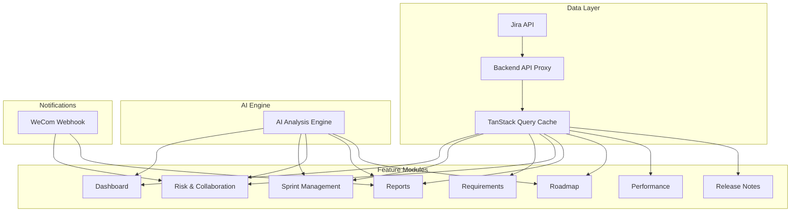
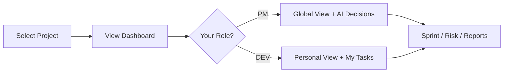
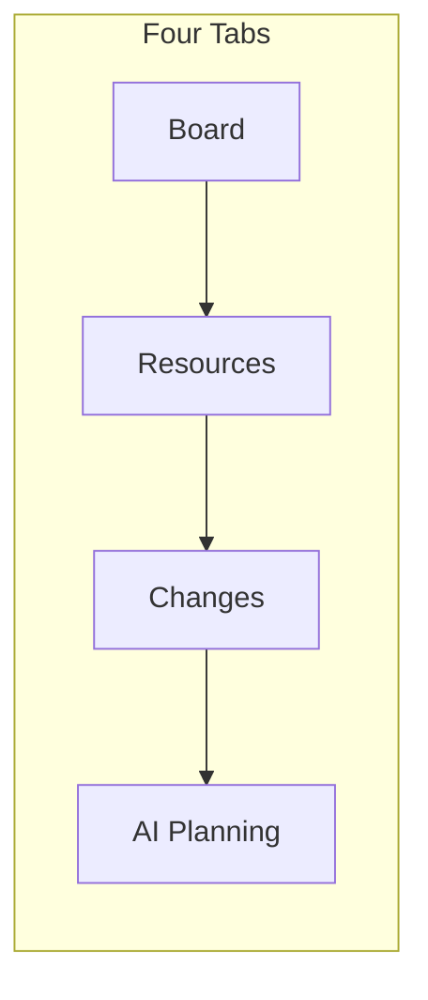
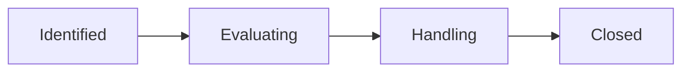
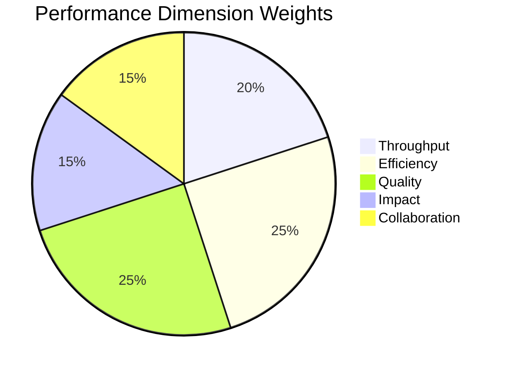
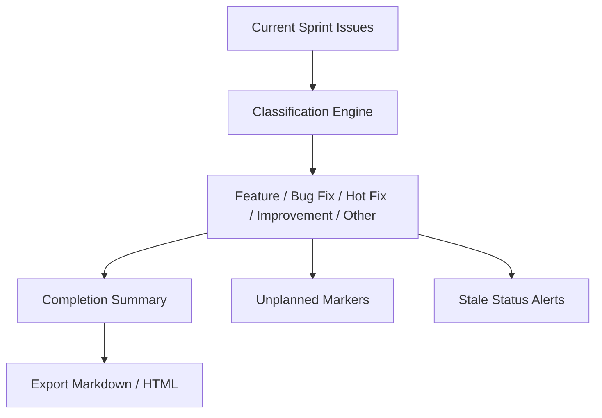
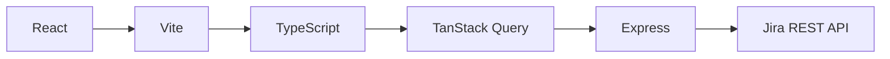

# AI-PM Platform User Guide

> AI-Powered Project Management · Jira Integration · Smart Analytics & Decisions

---

## Platform Architecture

---

## Getting Started

1. Select a Jira project from the top navigation bar
2. All pages automatically load data for the selected project
3. Use the left sidebar to navigate between modules

---

## Feature Modules

### 1. Dashboard

| Tab | Description | Role |
|-----|-------------|------|
| Global View | Sprint completion, task distribution, team workload, burndown | PM / DEV |
| Personal View | My tasks, progress stats | DEV |
| Performance | Five-dimension performance evaluation, team ranking | PM |
| Release Notes | Current sprint release summary, export | PM |
| AI Decision | AI-assisted decision suggestions | PM |

**AI Insights**: Click "Generate Analysis" at the top of any page for AI assessment.

---

### 2. Sprint Management

| Tab | Features |
|-----|----------|
| **Board** | 5-column kanban (To Do → In Progress → Review → Testing → Done), filters |
| **Resources** | Developer profiles, workload visualization (red/green/orange), team stats |
| **Changes** | AI change detection, impact analysis, scope creep warning (>20%) |
| **Planning** | AI scores and ranks Backlog candidates |

---

### 3. Requirements

- List view / Kanban view toggle
- Filter by status, priority, assignee, keyword
- Status stats bar at top, click to quick-filter
- All Ticket IDs clickable → opens Jira
- AI requirements health analysis

---

### 4. Risk & Collaboration

- Risk board: columns by status
- Cross-team collaboration: auto-detected cross-project tasks
- Dependencies: unassigned high-priority, overtime, stale tasks
- WeCom push: one-click risk notification

---

### 5. Reports

| Report Type | Content |
|-------------|---------|
| Daily | Today's progress, completed/new task stats |
| Weekly | Workload summary, risk overview, next week plan |
| Sprint Review | Completion rate, team contributions, improvement suggestions |

- One-click push to WeCom
- AI auto-generated progress summaries

---

### 6. Project Roadmap

- Horizontal timeline with milestones
- 4 built-in templates (Agile Sprint / Quarterly / Product Launch / Custom)
- Sync milestones from Jira Fix Versions
- AI roadmap health analysis

---

### 7. Department Performance

**Five-Dimension Model (SPACE + DORA):**

| Dimension | Weight | Calculation |
|-----------|--------|-------------|
| Throughput | 20% | Completed tasks × complexity factor, percentile rank in team |
| Efficiency | 25% | Average Cycle Time + on-time delivery rate within Sprint |
| Quality | 25% | Rework rate + Bug introduction rate |
| Impact | 15% | High-priority task completion ratio + blocking resolution speed |
| Collaboration | 15% | Cross-team comments + participation in others' tasks |

**Performance Grades:**

| Score | Grade | Color |
|-------|-------|-------|
| 80-100 | Excellent | 🟢 |
| 60-79 | Good | 🔵 |
| 40-59 | Average | 🟠 |
| 0-39 | Needs Improvement | 🔴 |

---

### 8. Release Notes

- Auto-aggregates current sprint issues
- Categorized display (collapsible sections)
- Completion summary (click numbers for details)
- Unplanned issue markers + filter toggle
- Stale status alerts (2 days before Sprint end)
- One-click export to Markdown / HTML

---

## Common Features

| Feature | Description |
|---------|-------------|
| 🔍 Global Search | Search by task ID, title, page name |
| 🔗 Ticket Links | All IDs clickable → opens Jira |
| 🌐 Multi-language | Chinese / English / Japanese / Spanish |
| 👤 Role Switching | PM / DEV roles with differentiated features |
| 🤖 AI Assistant | Bottom-right chat, query Jira data directly |
| 🔔 Notification Center | Real-time risk alerts and change notifications |

---

## Tech Stack

| Layer | Technology |
|-------|-----------|
| Frontend | React 18 + TypeScript + Vite |
| State | TanStack Query |
| Backend | Express (API Proxy) |
| AI | LLM API Integration |
| Notifications | WeCom Webhook |
| Deployment | Vercel + On-premise Node.js |

---

## Access

- **Public**: https://ai-pm-platform.item.pub/
- **Intranet**: http://192.168.x.x:3000 (run `启动服务.bat`)

