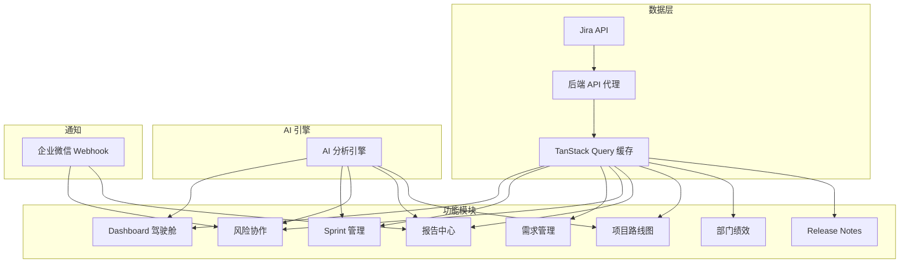
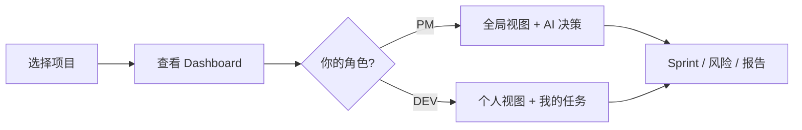
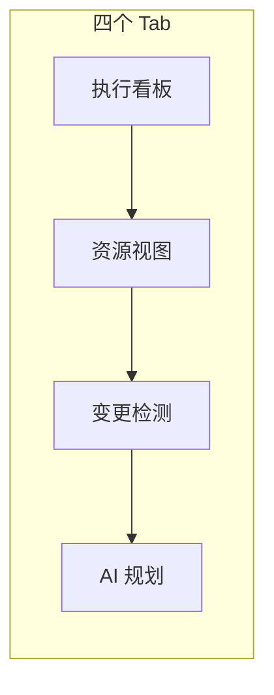
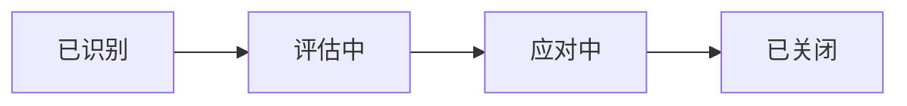
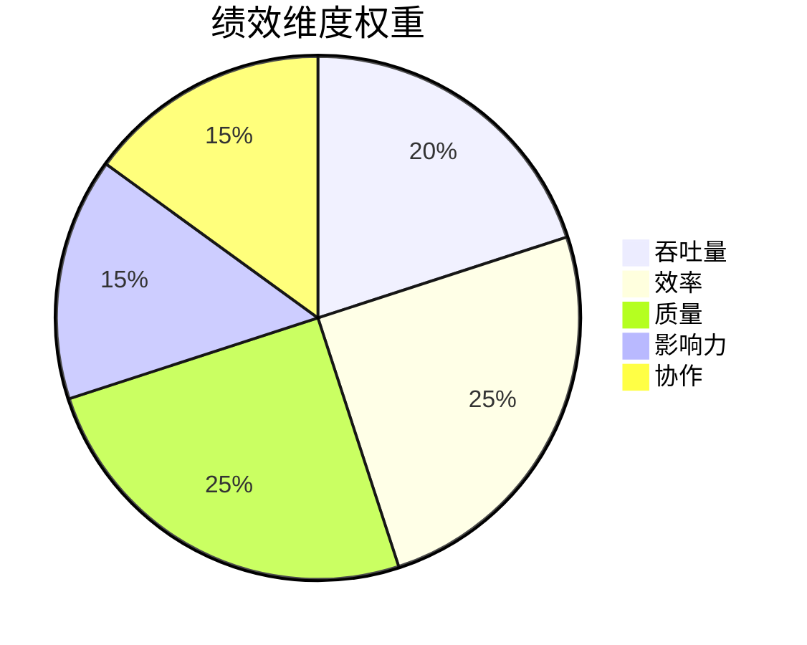
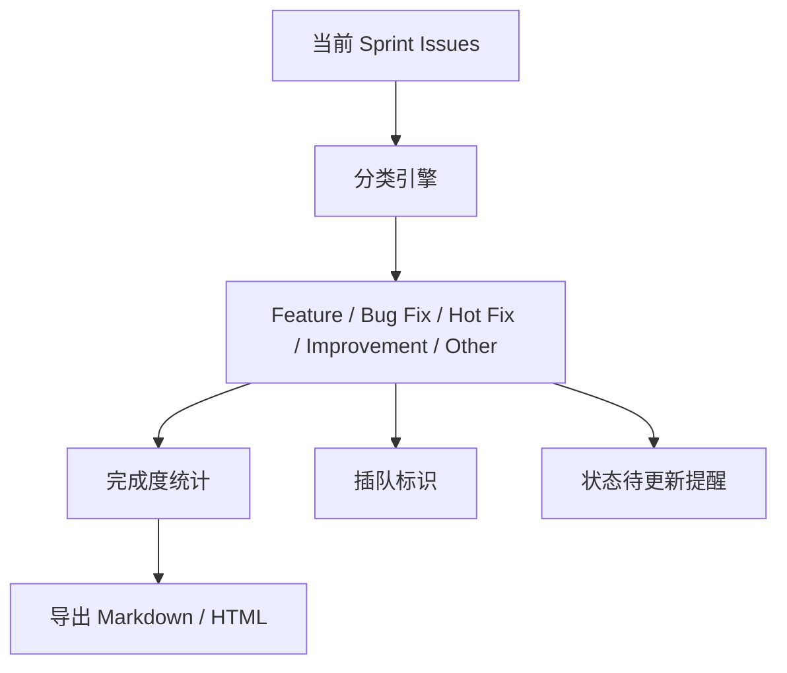
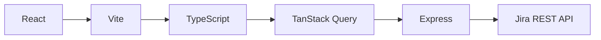

# AI-PM 平台用户指南

> AI 驱动的项目管理平台 · 集成 Jira · 智能分析与决策

---

## 平台架构

---

## 快速开始

1. 顶部导航栏选择 Jira 项目
2. 系统自动加载该项目数据
3. 左侧菜单切换功能模块

---

## 功能模块

### 1. Dashboard（项目驾驶舱）

| Tab | 说明 | 适用角色 |
|-----|------|----------|
| 全局视图 | Sprint 完成率、任务分布、团队负载、燃尽图 | PM / DEV |
| 个人视图 | 我的任务、进度统计 | DEV |
| 部门绩效 | 五维度绩效评估、团队排名 | PM |
| Release Notes | 当前迭代发版说明、导出 | PM |
| AI 决策 | AI 辅助决策建议 | PM |

**AI 洞察**：每个页面顶部点击"生成分析"获取 AI 评估。

---

### 2. Sprint 管理

| Tab | 功能 |
|-----|------|
| **执行** | 5 列看板（待办→进行中→评审→测试→完成），支持筛选 |
| **资源** | 开发者画像、负载可视化（红/绿/橙）、团队统计 |
| **变更** | AI 自动检测变更、影响分析、范围蔓延警告（>20%） |
| **规划** | AI 从 Backlog 评分推荐候选任务 |

---

### 3. 需求管理

- 列表视图 / 看板视图切换
- 按状态、优先级、负责人、关键词筛选
- 顶部状态统计栏，点击快速筛选
- 所有 Ticket ID 可点击跳转 Jira
- AI 需求健康度分析

---

### 4. 风险与协作

- 风险看板：按状态分列展示
- 跨团队协作：自动识别跨项目任务
- 依赖管理：未分配高优任务、超工时、长时间无更新
- 企微推送：一键推送风险通知

---

### 5. 报告中心

| 报告类型 | 内容 |
|----------|------|
| 日报 | 当日任务进展、完成/新增统计 |
| 周报 | 本周工作量、风险汇总、下周计划 |
| Sprint 复盘 | 完成率、团队贡献、改进建议 |

- 一键推送企业微信
- AI 自动生成进展摘要

---

### 6. 项目路线图

- 水平时间轴展示里程碑
- 4 个内置模板（Agile Sprint / 季度规划 / 产品发布 / 自定义）
- 从 Jira Fix Versions 同步里程碑
- AI 路线图健康分析

---

### 7. 部门绩效

**五维度评估模型（SPACE + DORA）：**

| 维度 | 权重 | 计算方式 |
|------|------|----------|
| 吞吐量 | 20% | 完成任务数 × 复杂度因子，团队内百分位排名 |
| 效率 | 25% | 平均 Cycle Time + Sprint 内按时交付率 |
| 质量 | 25% | 返工率 + Bug 引入率 |
| 影响力 | 15% | 高优先级任务完成比 + 阻塞解决速度 |
| 协作 | 15% | 跨团队评论数 + 他人任务参与度 |

**绩效等级：**

| 分数 | 等级 | 颜色 |
|------|------|------|
| 80-100 | Excellent | 🟢 |
| 60-79 | Good | 🔵 |
| 40-59 | Average | 🟠 |
| 0-39 | Needs Improvement | 🔴 |

---

### 8. Release Notes

- 自动聚合当前迭代 Issue
- 按类型分类展示（可折叠）
- 完成度摘要（点击数字查看明细）
- 插队 Issue 标识 + 筛选
- 状态不一致提醒（Sprint 结束前 2 天）
- 一键导出 Markdown / HTML

---

## 通用功能

| 功能 | 说明 |
|------|------|
| 🔍 全局搜索 | 搜索任务 ID、标题、页面名称 |
| 🔗 Ticket 链接 | 所有 ID 可点击跳转 Jira |
| 🌐 多语言 | 中文 / English / 日本語 / Español |
| 👤 角色切换 | PM / DEV 角色，功能差异化 |
| 🤖 AI 小助手 | 右下角对话框，直接查询 Jira 数据 |
| 🔔 通知中心 | 风险预警、变更通知实时推送 |

---

## 技术栈

| 层 | 技术 |
|----|------|
| 前端 | React 18 + TypeScript + Vite |
| 状态管理 | TanStack Query |
| 后端 | Express (API 代理) |
| AI | 大模型 API 集成 |
| 通知 | 企业微信 Webhook |
| 部署 | Vercel + 内网 Node.js |

---

## 访问方式

- **公网**：https://ai-pm-platform.item.pub/
- **内网**：http://192.168.x.x:3000（启动 `启动服务.bat`）

